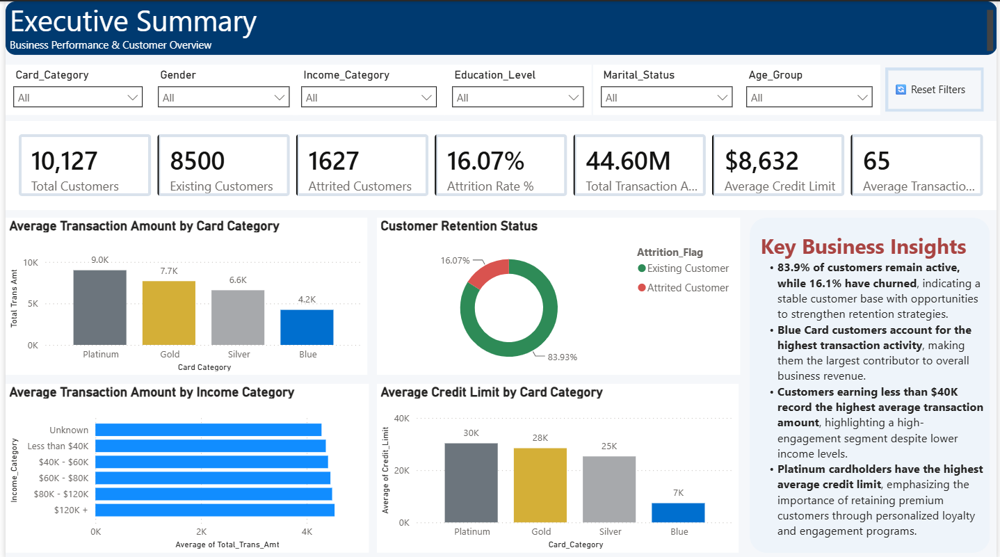
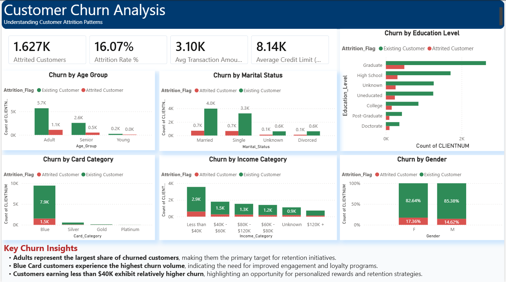
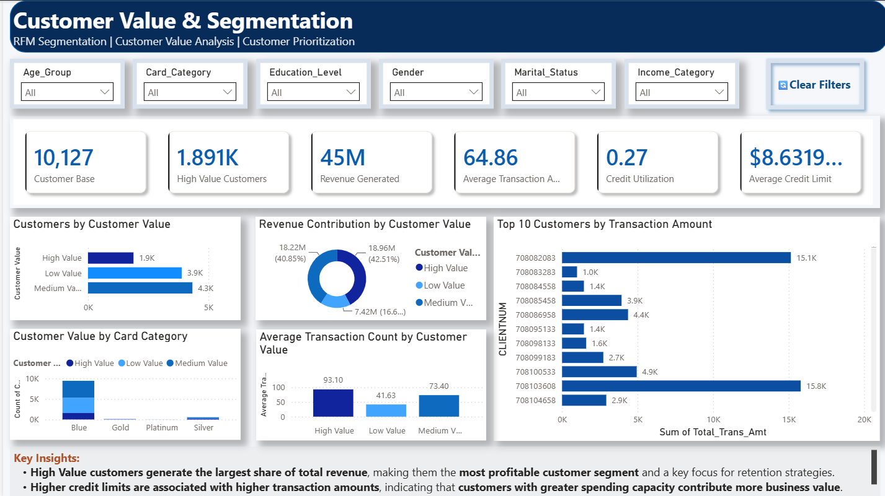

# 💳 Customer Lifetime Value & Retention Strategy

<p align="center">


</p>

<p align="center">
An end-to-end Data Analytics project focused on customer churn analysis, customer segmentation, and retention strategy using SQL, Python, Power BI, DAX, and Excel.
</p>

---

# 📑 Table of Contents

- Project Overview
- Business Problem
- Business Objectives
- Dataset
- Technology Stack
- Project Workflow
- SQL Analytics
- Python Analytics
- Power BI Dashboard
- Dashboard Preview
- DAX Measures
- Key Insights
- Business Recommendations
- Repository Structure
- Getting Started
- Future Improvements
- Skills Demonstrated
- Author

---

# 📌 Project Overview

Customer retention is one of the most important challenges in the Banking and Financial Services industry. Losing existing customers directly impacts revenue, customer lifetime value (CLV), and long-term profitability.

This project analyzes customer demographics, transaction behavior, credit utilization, and spending patterns to identify customer churn, segment customers based on value, and recommend strategies to improve customer retention.

The project demonstrates an end-to-end analytics workflow:

```
Business Understanding
        ↓
Data Cleaning
        ↓
SQL Analytics
        ↓
Python Exploratory Data Analysis
        ↓
Power BI Dashboard
        ↓
Business Insights
        ↓
Business Recommendations
```

---

# 🎯 Business Problem

Customer attrition reduces profitability and increases customer acquisition costs. Financial institutions need to proactively identify at-risk customers, understand spending behavior, and design targeted retention strategies.

---

# 🎯 Project Objectives

- Analyze customer churn trends.
- Identify high-value customer segments.
- Understand spending behavior.
- Detect customers at risk of becoming inactive.
- Build an interactive Power BI dashboard.
- Generate actionable business recommendations.

---

# 📊 Dataset

| Attribute | Details |
|------------|----------|
| Dataset | Bank Customer Churn Prediction |
| Records | 10,127 |
| Features | 23 |
| Domain | Banking & Financial Services |
| Target Variable | Attrition_Flag |

**Dataset Source:**

https://www.kaggle.com/datasets/gauravtopiwala/bank-customer-churn-prediction

---

# 🛠️ Technology Stack

- SQL (MySQL)
- Python
- Pandas
- NumPy
- Matplotlib
- Power BI
- DAX
- Microsoft Excel

---

# 🔄 Project Workflow

```
Business Understanding
        ↓
Data Cleaning
        ↓
SQL Analytics
        ↓
Python EDA
        ↓
Customer Segmentation
        ↓
Power BI Dashboard
        ↓
Business Insights
        ↓
Business Recommendations
```

---

# 🗄️ SQL Analytics

SQL was used to answer key business questions such as:

- Customer Lifetime Value Analysis
- Customer Inactivity Analysis
- Spending Behaviour Analysis
- Revenue Analysis
- Customer Engagement Analysis
- Customer Segmentation
- KPI Calculations

Advanced SQL concepts used:

- Aggregate Functions
- CASE Statements
- Window Functions
- Common Table Expressions (CTEs)
- Subqueries
- Ranking Functions

---

# 🐍 Python Analytics

Python was used for:

- Data Cleaning
- Exploratory Data Analysis (EDA)
- Customer Segmentation
- Correlation Analysis
- Data Visualization

Key visualizations include:

- Customer Age Distribution
- Gender Distribution
- Card Category Distribution
- Churn Analysis
- Revenue Analysis
- Correlation Heatmap
- Customer Value Distribution

---

# 📊 Power BI Dashboard

The interactive dashboard consists of three pages.

## 📄 Page 1 – Executive Summary

Provides a high-level overview of business performance through KPIs and customer metrics.

### KPIs

- Total Customers
- Attrition Rate
- Average Transaction Amount
- Average Credit Limit
- Average Utilization Ratio

---

## 📄 Page 2 – Customer Churn Analysis

Analyzes customer attrition across multiple demographic and behavioral dimensions.

Visualizations include:

- Churn by Card Category
- Churn by Income Category
- Churn by Age Group
- Churn by Gender
- Churn by Education Level
- Churn by Marital Status

---

## 📄 Page 3 – Customer Value & Segmentation

Identifies high-value customers and customer segments requiring focused retention strategies.

Visualizations include:

- Customer Value Distribution
- Revenue by Customer Segment
- Average Transaction Amount
- Average Credit Limit
- Customer Segmentation

---

# 📷 Dashboard Preview

## 📄 Executive Summary

<p align="center">
  
</p>

---

## 📄 Customer Churn Analysis

<p align="center">
  
</p>

---

## 📄 Customer Value & Segmentation

<p align="center">
  
</p>
---

# 📈 DAX Measures

The dashboard includes the following DAX measures:

- Total Customers
- Attrition Rate
- Total Revenue
- Average Transaction Amount
- Average Credit Limit
- Average Utilization Ratio
- High Value Customers

---

# 💡 Key Insights

- 83.9% of customers remain active, while 16.1% have churned.
- Adults account for the highest number of churned customers.
- Blue Card customers contribute the largest churn segment.
- Customers earning less than \$40K exhibit relatively higher churn.
- Platinum cardholders have the highest average credit limit.
- High-value customers generate a significant share of overall revenue.

---

# 📋 Business Recommendations

- Implement personalized retention campaigns for high-value customers.
- Develop an early warning system to identify customers at risk of churn.
- Increase engagement among Blue Card customers through loyalty programs.
- Offer personalized rewards based on spending behavior and customer value.
- Continuously monitor KPIs using interactive dashboards.

---

# 📁 Repository Structure

```text
Customer-Lifetime-Value-Retention-Strategy/

│
├── Dataset/
├── SQL/
├── Python/
├── Power BI/
├── Images/
├── Documentation/
├── README.md
└── requirements.txt
```

---

# 🚀 Getting Started

### Clone the Repository

```bash
git clone https://github.com/Himanshu6203/Customer-Lifetime-Value-Retention-Strategy.git
```

### Install Required Libraries

```bash
pip install -r requirements.txt
```

### Run the Project

1. Execute SQL queries in MySQL.
2. Run the Python notebook.
3. Open the Power BI dashboard (`.pbix`) in Power BI Desktop.

---

# 📈 Future Improvements

- Customer Churn Prediction using Machine Learning
- Customer Lifetime Value (CLV) Prediction
- Real-time Dashboard using Power BI Service
- Automated Data Refresh
- Interactive What-If Analysis

---

# 🚀 Skills Demonstrated

- SQL Analytics
- Python Data Analysis
- Data Cleaning
- Exploratory Data Analysis
- Customer Segmentation
- Customer Churn Analysis
- KPI Development
- DAX
- Power BI Dashboard Development
- Business Analysis
- Data Storytelling

---

# 👨‍💻 Author

**Himanshu Singh Kothariya**

**Aspiring Data Analyst | Business Analyst**

- **GitHub:** https://github.com/Himanshu6203
- **LinkedIn:** https://www.linkedin.com/in/himanshu-singh-kothariya-490a1a28b/

---

## ⭐ If you found this project useful, please consider giving it a star!
